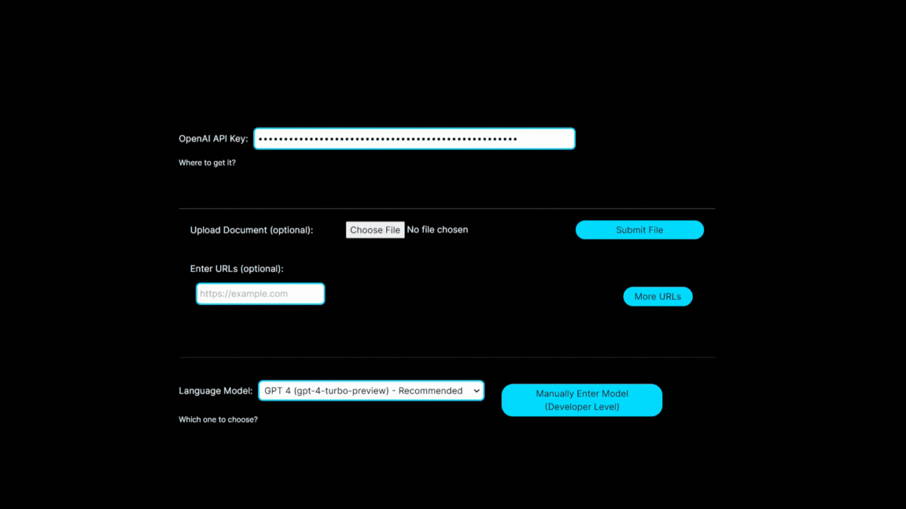
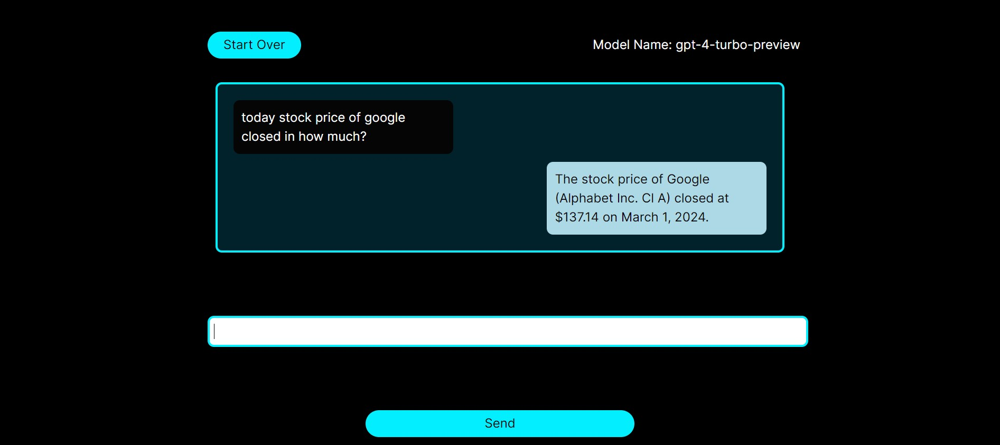

This application is created to mitigate the limits imposed by chatgpt like no access to realtime data as well as help analyzing reasearch papers and custom data of user.
#### Backend is written in Python Language and frontend created by Nextjs and Reactjs. 
## Test the app: https://raggpt.vercel.app/
The app is deployed on the [LINK](https://raggpt.vercel.app/). It only needs you to have OpenAI API key to use GPT models. Please note that this is a test server, which means its computational capacity is limited. Additionally, for real-time data, some URLs might encounter failures. For best experience, I highly recommend deploying the app on your local computer. Detailed instructions are provided below.

#### Full demo video is in assets folder.
## Why to use

### Access to realtime 
#### Needs to provide a url (e.g. a stock exchange website) 


### Helps researchers to analyze the papers easier and save time


#### And more...like answering questions about user custom file
Needs to upload your file
```
Question: How many different customer names exist in my file
```
```
Answer: There are 55 different customer names.
```

## Deploy the app on your computer
First you need to clone the repository and unzip it. For IDE, I recommend Visual Studio Code and you can install it by [LINK](https://code.visualstudio.com/download). Then you need to open two windows in VSC. By first one, open the folder of /backend to run server by below commands:

```
pip install -r requirements.txt
```
```
python .\main.py
```

Then in the other windows of VSC, go to folder /frontend/frontend (here you should see folders like public and scr). Now apply below commands:
```
npm i react-spinners
```
```
npm install next@latest react@latest react-dom@latest
```
```
npm run dev
```
Congrats, all done! 
#### NB: make sure both client side app and server are running at the same time. Simply, it means two mentioned VSC windows should be open at the same (do not close one and use another).
